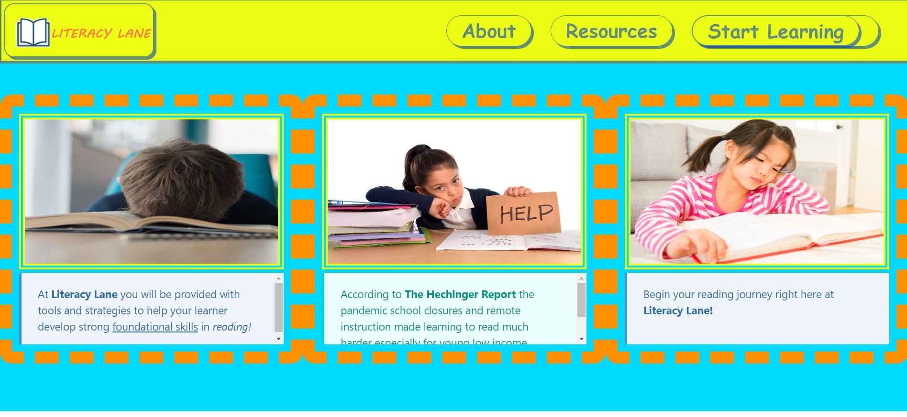
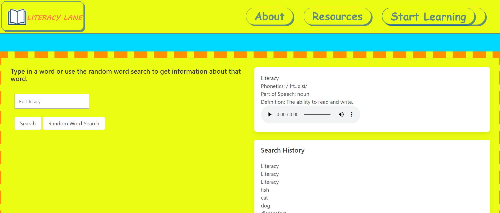

# P1-G7-Literacy-Lane

## Description

Our motivation was to create a “one stop shop” for users to overcome any kind of struggles with literacy or pronunciation. Literacy Lane is a simple learning site for anyone learning English. You will have access to resources guiding you through reading strategies and interactive learning with the ability to generate words with content. Click "Start Learning" to go down Literacy Lane and begin your education today! We built this project initially because our group member Jasmina is a teacher and has noticed the need for more outlets for reading comprehension and pronunciation practice. We are aiming to amend this decline in literacy education(especially after the Pandemic) which is supported by official studies like the Hechinger Study. Through various initial difficulties, we were able to merge github branches without issue at the end of this project. We also practiced various techniques such as using local storage, calling APIs, html mapping, and css frameworking. Additionally, we worked with the CSS Framework Bulma, and Javascript modals. 

## Table of Contents (Optional)

- [Installation](#installation)
- [Usage](#usage)
- [Credits](#credits)
- [License](#license)

## Usage

To use the program, open the page on the browser then you can read our about and resources sections, or click start learning to begin the actual excercises. 
 
 
   
   

## Credits

-Emmanuel Lakis (https://github.com/pexApred)  
-Jasmina Otero (https://github.com/shecodes1222)  
-Evan Paul Gilmore (https://github.com/E-P-Gils)  
-Deion Ponsones (https://github.com/dponsones)  
-Benicio Lopez: Tutor assistance  
-Sachin Jhaveri: Tutor assistance  
-Bulma Framework(Jeremy Thomas): https://bulma.io/  
-jQuery Library(John Resig): https://jquery.com/  

## License

MIT License

Copyright (c) 2022 pexApred

Permission is hereby granted, free of charge, to any person obtaining a copy of this software and associated documentation files (the "Software"), to deal in the Software without restriction, including without limitation the rights to use, copy, modify, merge, publish, distribute, sublicense, and/or sell copies of the Software, and to permit persons to whom the Software is furnished to do so, subject to the following conditions:

The above copyright notice and this permission notice shall be included in all copies or substantial portions of the Software.

THE SOFTWARE IS PROVIDED "AS IS", WITHOUT WARRANTY OF ANY KIND, EXPRESS OR IMPLIED, INCLUDING BUT NOT LIMITED TO THE WARRANTIES OF MERCHANTABILITY, FITNESS FOR A PARTICULAR PURPOSE AND NONINFRINGEMENT. IN NO EVENT SHALL THE AUTHORS OR COPYRIGHT HOLDERS BE LIABLE FOR ANY CLAIM, DAMAGES OR OTHER LIABILITY, WHETHER IN AN ACTION OF CONTRACT, TORT OR OTHERWISE, ARISING FROM, OUT OF OR IN CONNECTION WITH THE SOFTWARE OR THE USE OR OTHER DEALINGS IN THE SOFTWARE.

## Features

-Video Modal  
-Dictionary Search Feature  
-Random Word Generation Feature  
-Phoenetics Generation for Searched and Random Words  
-Working gifs on the page  